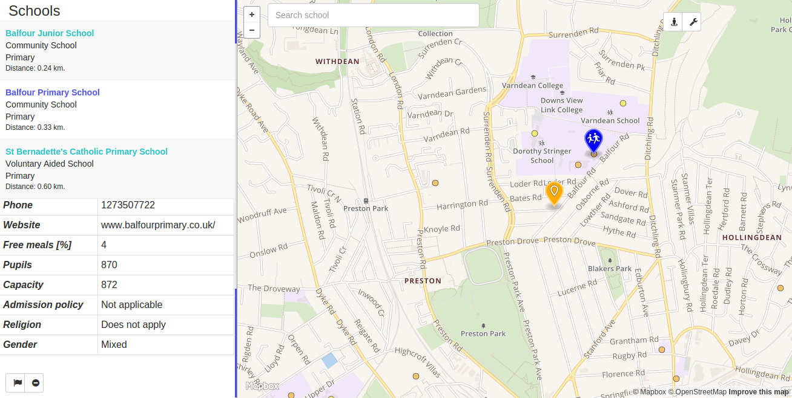

# Overview - Find your perfect school

**Application description**: Showing schools on the map, each type of school has different color.
Schools are sorted by the distance from selected spot and user can set maximum possible distance to school.
The user can also filter schools by criminality, that was commited near school, or number of bar/pubs and casinos near school.

The application shows schools in UK on a map. Most important features are:
- ordering by proximity from selected location
- search by school name
- search by school type (Universities, Free schools, Academies, Colleges) or by education phase (Nursery, Primary, Secondary)
- schools have different marker colors based on school type and education phase
- get crimes near school by crime type and shows them on the map
- get undesired locations (bars, pubs, casinos, ...) nearby school

Application *Find your perfect school* in action:



The application has 2 distinct parts, which are part of this Express.js project. The client, which is a [frontend web application](#frontend) using [angular.js](https://angularjs.org/), mapbox API, mapbox.js
and the [backend application](#backend) written in [Express.js](http://expressjs.com/), backed by PostGIS. The frontend application communicates with backend using a [REST API](#api). Express.js dependencies can be found in the `package.json`.

# Frontend

The frontend application is a static HTML page (`public/html/index.html`), which shows a mapbox.js widget.
There is every school in the UK on the map. Map style is based on OSM Bright 2 and it is modified to better highlight rails stations.

All html tags (angular.js directives) from `index.html` can be found in the `public/js/directives.js`. Frontend code responsibilities are:
- displaying the sidebar panel with school list and school detail
- calling the backend API (all API calls are in `public/js/services.js` ), formatting the data
- displaying geo features by overlaying the map with a feature layer, the geojson is provided by backend APIs, styling the markers
(code in `public/js/utils.js`)

# Backend

The backend application is written in Express.js and is responsible for querying geo data, formatting the geojson and data for the sidebar panel. API functions can be found in `routes` directory with their API paths in `app.js` in root directory.

## Data

I downloaded an extent covering whole [Great Britain](http://download.geofabrik.de/europe/great-britain.html) (around 780MB) and imported it using the osm2pgsql tool into the standard OSM schema in WGS 84 (espg 4326).
[Education.gov.uk](http://www.education.gov.uk/edubase/home.xhtml) is publishing open data of all UK schools.
I downloaded records of all 43 836 UK schools it in csv file and load it into a database table `schools`. School locations in the csv file
are in the UK northing, easting formatting, so I converted them to WGS84(lat,long).
UK police publish [criminality data in the UK](https://data.police.uk/about/) on a monthly basis divided by police force regions.
I downloaded data from August 2015 which contains 509 020 crime records with anonymised latitude, longitude locations.

To speedup the queries I created an index on geometry column (way) and geography column (geog) in all tables. For schools
I added indexes also to name, est_type and est_phase columns, which are used for searching and filtering.
GeoJSON is generated by using a standard st_asgeojson function, however some postprocessing is necessary
(in `routes/api.js`) in order to merge all schools or crimes into a single geojson.

**Data source**:
- [Open Street Maps](https://www.openstreetmap.org/)
- [UK OpenStreetMaps](http://download.geofabrik.de/europe/great-britain.html)
- [Schools In England Dec 2014](http://data.bureau.opendata.arcgis.com/datasets/4dbf29eb5ee0418c874782669aecf38d_0)
- [Education.gov.uk](http://www.education.gov.uk/edubase/home.xhtml)
	- [Web API](http://education.data.gov.uk/)
- [Schools in England monthly](https://www.gov.uk/government/publications/schools-in-england)
- [Criminality In The UK](https://data.police.uk/about/)

**Technologies used**:
- Mapbox.js
- Mapbox API
- PostGIS
- Express.js
- Angular.js


## Installation
```
git clone
npm install
npm start
```

## Api

**Find schools in proximity to coordinates, filter by education type or phase. Sorted by proximity.**

`GET /api/schools/identifylat=51.505&lon=0.06&phase=0`

`GET /api/schools/identifylat=51.505&lon=0.06&type=1`

`` returns array containing school objects``

**Find crimes near school by school id. Returns crimes data with crimes locations in geojson and crime statistics by crime type**

``GET /api/crimes/identify?schoolId=126585``

```
{
   "geojsons":[
      {
         "crime_type":"Anti-social behaviour",
         "geojson":"{\"type\":\"Point\",\"coordinates\":[0.086681999266148,51.4883308410645]}"
      },
      {
         "crime_type":"Anti-social behaviour",
         "geojson":"{\"type\":\"Point\",\"coordinates\":[0.06954400241375,51.4906463623047]}"
      }
   ],
   "totalCount":411,
   "crimes":[
      {
         "crimetype":"Violence and sexual offences",
         "counts":"119"
      },
      {
         "crimetype":"Anti-social behaviour",
         "counts":"91"
      },
      {
         "crimetype":"Shoplifting",
         "counts":"35"
      },
      {
         "crimetype":"Drugs",
         "counts":"32"
      },
      {
         "crimetype":"Public order",
         "counts":"29"
      },
      {
         "crimetype":"Criminal damage and arson",
         "counts":"23"
      }
   ]
}
```

**Find undesired locations near school by school id. Returns location type with location in geojson.**

``GET dangers/identify?schoolId=126585``

```
[
   {
      "amenity":"pub",
      "geojson":"{\"type\":\"Point\",\"coordinates\":[0.0735691,51.4818071]}"
   },
   {
      "amenity":"bar",
      "geojson":"{\"type\":\"Point\",\"coordinates\":[0.069644,51.4908978]}"
   }
]
```

**Search school by name. Fulltext search combined with prefix LIKE approach.**

``GET /api/schools?name=Wim``

`` returns array containing school objects``

**Get school data by school urn (id).**

`` GET /schools/130545``

`` returns object containing all school data and location in geojson``

# General course assignment

Build a map-based application, which lets the user see geo-based data on a map and filter/search through it in a meaningfull way. Specify the details and build it in your language of choice. The application should have 3 components:

1. Custom-styled background map, ideally built with [mapbox](http://mapbox.com). Hard-core mode: you can also serve the map tiles yourself using [mapnik](http://mapnik.org/) or similar tool.
2. Local server with [PostGIS](http://postgis.net/) and an API layer that exposes data in a [geojson format](http://geojson.org/).
3. The user-facing application (web, android, ios, your choice..) which calls the API and lets the user see and navigate in the map and shows the geodata. You can (and should) use existing components, such as the Mapbox SDK, or [Leaflet](http://leafletjs.com/).

### TODO
- ~~import OpenStreetMaps~~
- ~~import schools data~~
- ~~import criminality data~~
- ~~website~~
- ~~display map~~
- ~~db connection~~
- ~~web interface - Angular~~
- ~~db module~~
- ~~zoom, pan to detail~~
- ~~results table~~
- ~~schools colors~~
- ~~full text~~
- add mouse cursors
- toggle active layers based on chosen school type
- add legend

